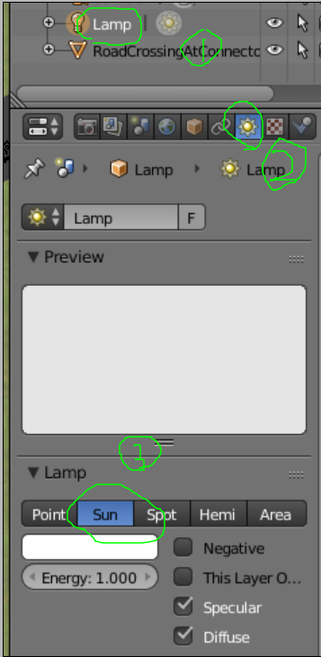

# ModifiedOSM2World平台使用

## １．概要

此转换方法基于开源的`OSM2Word`转换包，进行车道渲染、材质渲染等方面的优化后用于将`.osm`格式的路网转换为`.obj`或者`.dae`格式的3D模型，最终加载到Gazebo仿真器中进行场景仿真。


## ２．平台环境及依赖

- OS: Ubuntu 16.04 (Xenial)及以上版本
- RＯS: Kinetic Kame
- Gazebo 7.0以上版本（不包含Gazebo 7.0） & RVIZ
- Blender 2.76 


## ３．安装和使用

打开终端，运行以下指令获取`ModifiedOSM2World`包：

```C++
git clone git@github.com:carolina68/ModifiedOSM2World.git
cd $path to$/ModifiedOSM2World
```

编译方式如下，编译完成后将在`./target`文件夹下生成目标文件`osm2world-0.3.0-SNAPSHOT.jar`。

```
mvn package
```

### 3.1 导出初步3D模型（`.obj`格式）

运行：

```
java -jar ./target/osm2world-0.3.0-SNAPSHOT.jar --config ./standard.properties -i ./maps/example.osm -o ./meshes/example.obj
```

语句执行后将生成`.obj`文件以及存储材质和贴图信息的`.obj.mtl`文件，后者需要对应其引用的图片的正确路径（通常可以直接放于同一文件夹`meshes`下）。

### 3.2　Blender修正

打开Blender，`File`->`import`->`obj`。

#### 3.2.1 光效

* 界面下方`Viewport Shading`选择`Rendered`；
* 光标置于模型上，点击按键`A`选中所有子块，`Ctrl`+`j`合并所有子块为一个整体；
* 界面右侧选择`Lamp`->倒数第三个图标->`Sun`。




#### 3.2.2 指定模型坐标系原点

<https://jingyan.baidu.com/article/af9f5a2d738d6043140a45a7.html>

#### 3.2.3 导出注意项

* 修正后的模型导出为`.obj`格式（Gazebo 7.0以上支持），即`File`->`Export`->`.obj`;
* 左侧选择`Forward`->`X Forward`, `Up`->`Z Up`。


### 3.3 Gazebo模型包制作

* Gazebo的模型库路径默认为`$HOME$/.gazebo/models/`;
* 参照任意已有模型，如`ambulance`，进行如下操作：
  * 设置model.config；
  * 设置model.sdf；
  * 将`.obj`和`.mtl`文件放入`./meshes`文件加下；
  * 将`.mtl`文件引用的图片放入`./materials/textures/`文件夹下，同时更新`.mtl`文件引用的图片路径。

### 3.4　查看模型

```
cd $HOME$
gazebo
```

在Gazebo中选择插入对应模型即可。


## ４．改进内容

### 4.1 实线渲染

`./srcmain/java/org/osm2word/core/world/modules/RoadModule.java`, Line 846 - 880。

```C++
			if (vehicleLaneCountRight > 0 && vehicleLaneCountLeft > 0) {

				LaneType dividerType = DASHED_LINE;

				if ("dashed_line".equals(divider)) {//虚线统一到私有标签的表示
					dividerType = DASHED_LINE;
				} else if ("line".equals(divider)) {//实现统一到私有标签的表示
					dividerType = SOLID_LINE;
				} else if ("u_turn".equals(divider)) {
					dividerType = UTURN_LINE;
				}else if ("physical".equals(divider)) {
					dividerType = PHYSICAL_LINE;
				}else if ("no".equals(divider)) {
					dividerType = null;
				} else {
                    
					...
                        
					if (!overtakingForward && !overtakingBackward) {
						dividerType = SOLID_LINE;
					} //TODO else if ... for combined solid and dashed lines
					else{
                        	//默认为虚线，原始OSM2World设置的默认线型为实现（车道与车道之间虚线渲染错误）
							dividerType = DASHED_LINE;
					}

				}
```

### 4.2 反向道路分隔线渲染

```C++
//统一为黄色实线
public static final ConfMaterial ROAD_MARKING_DIVIDER =
		new ConfMaterial(Interpolation.FLAT, new Color(1.0f, 1.0f, 0.0f));
```

### 4.3 贴图渲染

原始`standard.propreties`导出的模型中，路面、路面箭头、斑马线都会出现渲染问题，因此采用修正后的材质图片。包括

* `MarekAsphalt0001_grey.png`
* `road_marking_dash_grey.png`
* `road_marking_crossing_grey.png`
* `road_arrow_through_grey.png`
* `road_arrow_right_grey.png`
* `road_arrow_right_left_grey.png`
* `road_arrow_through_right_grey.png`
* `road_arrow_through_enlarged_grey.png`

同时`standard.propreties`中也作出相应调整。


### 4.4 箭头贴图平铺（未解决）

路面箭头纵向多个平铺，相关代码见`./srcmain/java/org/osm2word/core/world/modules/RoadModule.java`, Line 2208 - 2287。

